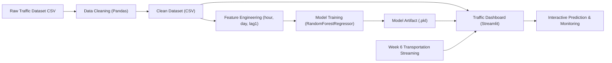
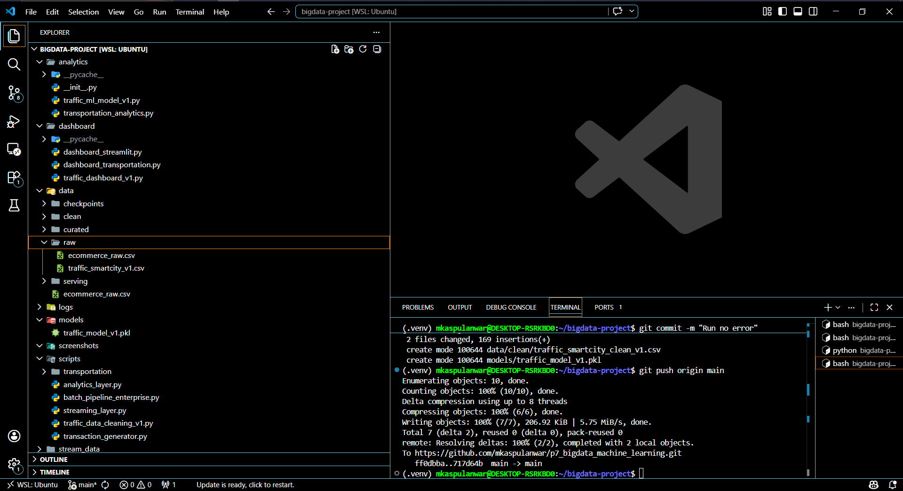
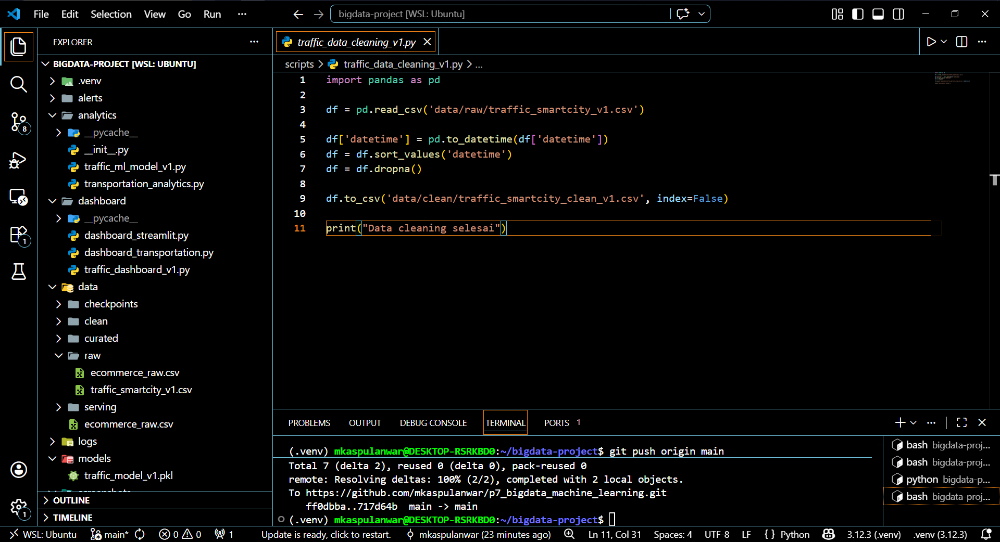
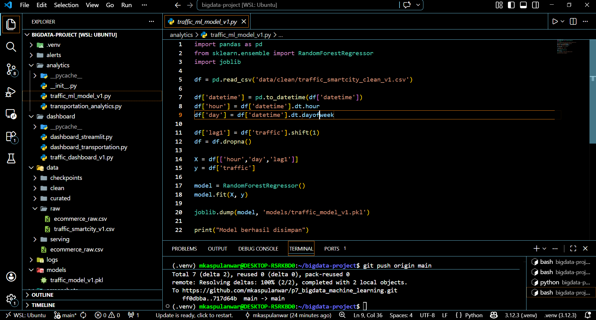
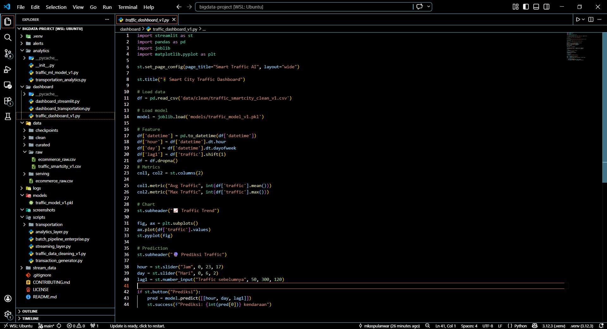
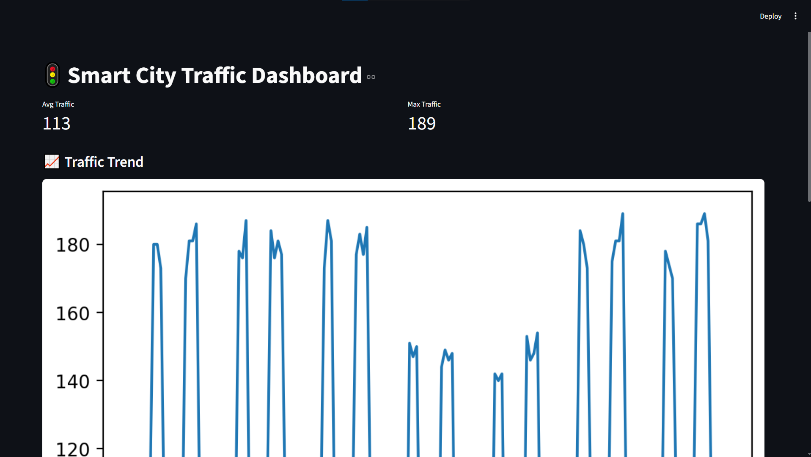
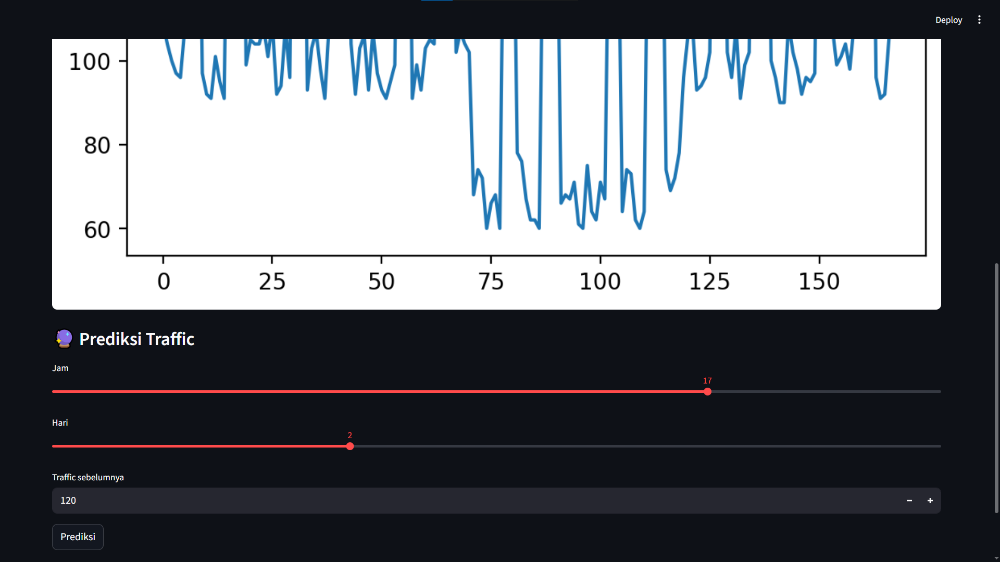
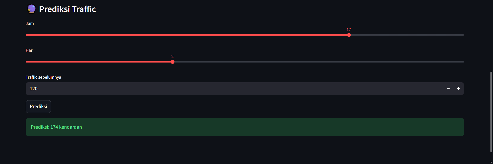

# Praktikum Big Data Week 7: Machine Learning untuk Prediksi Traffic (Smart City AI)


## Tim Praktikum

| Peran | Nama | NIM | Profil GitHub |
| :--- | :--- | :--- | :--- |
| **Pengembang Proyek** | M. Kaspul Anwar | 230104040212 | [](https://github.com/mkaspulanwar) |
| **Dosen Pengampu** | Muhayat, M. IT | - | [](https://github.com/muhayat-lab) |

---

## Ringkasan Praktikum Week 7

Praktikum Week 7 berfokus pada implementasi **Machine Learning untuk Prediksi Traffic Smart City** sebagai kelanjutan dari Week 6 (real-time analytics dan visualisasi skala besar).

Pada Week 6, sistem sudah mampu melakukan ingestion, processing, dan visualisasi data transportation secara near real-time. Pada Week 7, proyek diperluas dengan lapisan **predictive analytics** untuk memprediksi kepadatan traffic menggunakan model machine learning.

## Tujuan Praktikum

1. Menyiapkan data traffic agar layak untuk training model.
2. Membangun baseline model regresi untuk memprediksi jumlah kendaraan.
3. Mengintegrasikan model ke dashboard interaktif untuk inferensi cepat.
4. Mendokumentasikan alur end-to-end dari data mentah sampai prediksi.
5. Menjaga kesinambungan arsitektur Week 6 ke Week 7.

## Cakupan Fitur Week 7

1. **Data cleaning pipeline** untuk dataset traffic smart city.
2. **Feature engineering berbasis waktu** (`hour`, `day`) dan fitur historis (`lag1`).
3. **Model training** menggunakan `RandomForestRegressor`.
4. **Model persistence** ke artifact `models/traffic_model_v1.pkl`.
5. **Dashboard prediksi** berbasis Streamlit untuk eksplorasi metrik dan simulasi prediksi.

## Arsitektur Sistem (Week 6 -> Week 7)



## Struktur Project (Terbaru)

```bash
bigdata-project/
|-- alerts/
|   `-- transportation_alert.py
|-- analytics/
|   |-- transportation_analytics.py
|   `-- traffic_ml_model_v1.py            # Week 7: training model prediksi traffic
|-- dashboard/
|   |-- dashboard_streamlit.py
|   |-- dashboard_transportation.py
|   `-- traffic_dashboard_v1.py           # Week 7: dashboard prediksi traffic
|-- data/
|   |-- raw/
|   |   |-- ecommerce_raw.csv
|   |   `-- traffic_smartcity_v1.csv      # Dataset Week 7 (raw)
|   |-- clean/
|   |   `-- traffic_smartcity_clean_v1.csv
|   |-- serving/
|   |   |-- stream/
|   |   |-- transportation/
|   |   |-- total_revenue/
|   |   |-- top_products/
|   |   |-- category_revenue/
|   |   `-- avg_transaction/
|   |-- curated/
|   `-- checkpoints/
|-- models/
|   `-- traffic_model_v1.pkl              # Artifact model Week 7
|-- scripts/
|   |-- batch_pipeline_enterprise.py
|   |-- streaming_layer.py
|   |-- analytics_layer.py
|   |-- transaction_generator.py
|   |-- traffic_data_cleaning_v1.py       # Week 7: preprocessing traffic
|   `-- transportation/
|       |-- trip_generator.py
|       `-- streaming_trip_layer.py
|-- stream_data/
|   `-- transportation/
|-- logs/
|-- screenshots/
|   |-- struktur_project.png
|   |-- scripts_cleaning.png
|   |-- scripts_modeling.png
|   |-- scripts_dashboard.png
|   |-- dashboard_1.png
|   |-- dashboard_2.png
|   `-- nilai_prediksi.png
|-- .gitignore
|-- CONTRIBUTING.md
|-- LICENSE
`-- README.md
```

## Dataset Week 7

Sumber dataset utama berada di:

- `data/raw/traffic_smartcity_v1.csv`

Ringkasan data:

1. Jumlah baris: **168 records**.
2. Rentang waktu: **2025-01-01 00:00:00 sampai 2025-01-07 23:00:00**.
3. Frekuensi: **per jam (hourly)**.

Skema kolom:

| Kolom | Tipe | Deskripsi |
| :--- | :--- | :--- |
| `datetime` | datetime | Timestamp observasi traffic |
| `traffic` | int/float | Jumlah kendaraan pada timestamp tersebut |

## Penjelasan Alur Week 7 (End-to-End)

### 1) Data Cleaning

Script: `scripts/traffic_data_cleaning_v1.py`

Proses utama:

1. Membaca data mentah dari `data/raw/traffic_smartcity_v1.csv`.
2. Parsing kolom `datetime` menjadi tipe waktu.
3. Sort data berdasarkan waktu.
4. Menghapus baris bernilai null (`dropna`).
5. Menyimpan output ke `data/clean/traffic_smartcity_clean_v1.csv`.

Jalankan:

```bash
python scripts/traffic_data_cleaning_v1.py
```

### 2) Modeling Machine Learning

Script: `analytics/traffic_ml_model_v1.py`

Proses utama:

1. Membaca data bersih.
2. Membuat fitur turunan:
   - `hour` = jam (0-23)
   - `day` = indeks hari (0-6)
   - `lag1` = traffic satu periode sebelumnya
3. Menentukan target `y = traffic`.
4. Training model `RandomForestRegressor` (baseline).
5. Menyimpan model ke `models/traffic_model_v1.pkl`.

Jalankan:

```bash
python analytics/traffic_ml_model_v1.py
```

### 3) Dashboard Prediksi

Script: `dashboard/traffic_dashboard_v1.py`

Fitur dashboard:

1. Menampilkan KPI sederhana (`Avg Traffic`, `Max Traffic`).
2. Menampilkan grafik trend traffic.
3. Menyediakan input interaktif (`hour`, `day`, `lag1`) untuk simulasi prediksi.
4. Menampilkan output prediksi jumlah kendaraan.

Jalankan:

```bash
streamlit run dashboard/traffic_dashboard_v1.py
```

## Setup Environment

### 1) Prasyarat

1. Python 3.10+ (disarankan 3.12).
2. Pip dan virtual environment.
3. Java (opsional, jika juga menjalankan pipeline Spark Week 6).

### 2) Membuat Virtual Environment

Linux/macOS:

```bash
python -m venv .venv
source .venv/bin/activate
```

PowerShell:

```powershell
python -m venv .venv
.venv\Scripts\Activate.ps1
```

### 3) Install Dependency

```bash
pip install pandas scikit-learn joblib streamlit matplotlib pyspark pyarrow
```

## Quick Run (Rekomendasi Praktikum 7)

Jalankan berurutan dari root project:

```bash
python scripts/traffic_data_cleaning_v1.py
python analytics/traffic_ml_model_v1.py
streamlit run dashboard/traffic_dashboard_v1.py
```

## Validasi Keberhasilan

Praktikum dianggap berhasil jika:

1. File `data/clean/traffic_smartcity_clean_v1.csv` terbentuk setelah cleaning.
2. File `models/traffic_model_v1.pkl` terbentuk setelah training.
3. Dashboard terbuka tanpa error dan menampilkan metrik serta grafik trend.
4. Tombol prediksi menghasilkan nilai prediksi kendaraan dari input pengguna.

## Bukti Implementasi (Screenshots)









## Integrasi Dengan Praktikum 6

Komponen Week 6 tetap dipertahankan di repo (streaming transportation, analytics, alert, dan dashboard). Dengan demikian, repository ini sekarang mencakup dua spektrum analitik:

1. **Descriptive + Real-Time Analytics** (Week 6).
2. **Predictive Analytics (Machine Learning)** (Week 7).

Pendekatan ini merepresentasikan alur smart city data platform yang lebih lengkap: dari observasi traffic hingga prediksi traffic.

## Troubleshooting

1. Jika error `No module named ...`, pastikan virtual environment aktif dan dependency sudah terinstall.
2. Jika model tidak ditemukan di dashboard, jalankan ulang script training model.
3. Jika data bersih tidak ditemukan, jalankan ulang script cleaning.
4. Jika tampilan dashboard kosong, pastikan file `data/clean/traffic_smartcity_clean_v1.csv` berisi data valid.

## Keterbatasan Baseline Saat Ini

1. Model belum menggunakan train/test split dan evaluasi metrik formal (MAE/RMSE/R2).
2. Fitur masih sederhana (`hour`, `day`, `lag1`) dan belum mencakup cuaca/event kota.
3. Belum ada retraining otomatis periodik.

## Rencana Pengembangan Lanjutan

1. Menambahkan evaluasi model terukur (MAE, RMSE, R2) dan visual error analysis.
2. Menambahkan fitur eksternal (cuaca, hari libur, event, kepadatan area).
3. Menyusun pipeline retraining terjadwal dan versioning model.
4. Integrasi prediksi ke layer alert real-time untuk proactive traffic management.

## Penutup

Week 7 berhasil memperluas fondasi Week 6 dari sekadar monitoring real-time menjadi sistem yang mulai memiliki kemampuan prediktif. Hasilnya, repository ini kini lebih siap digunakan sebagai prototipe **Smart City AI** yang menggabungkan ingestion, analytics, visualisasi, dan prediksi traffic dalam satu alur terpadu.
