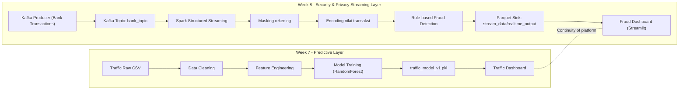
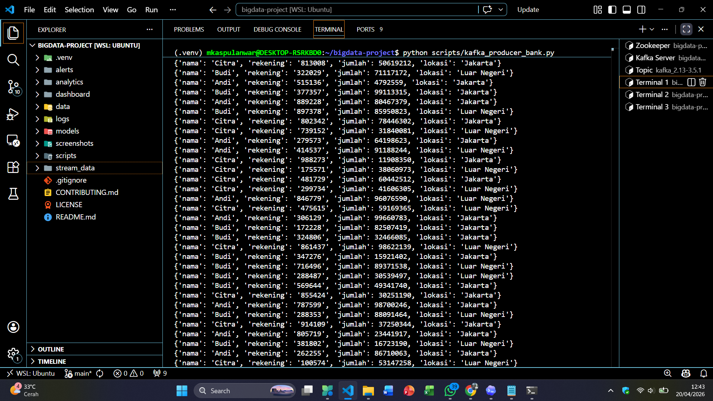
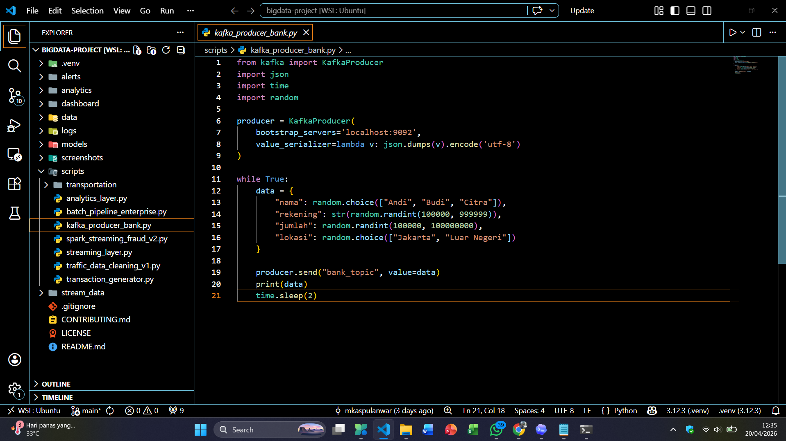
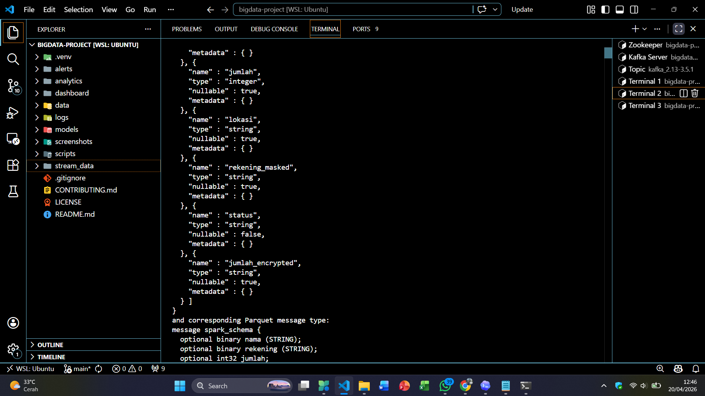
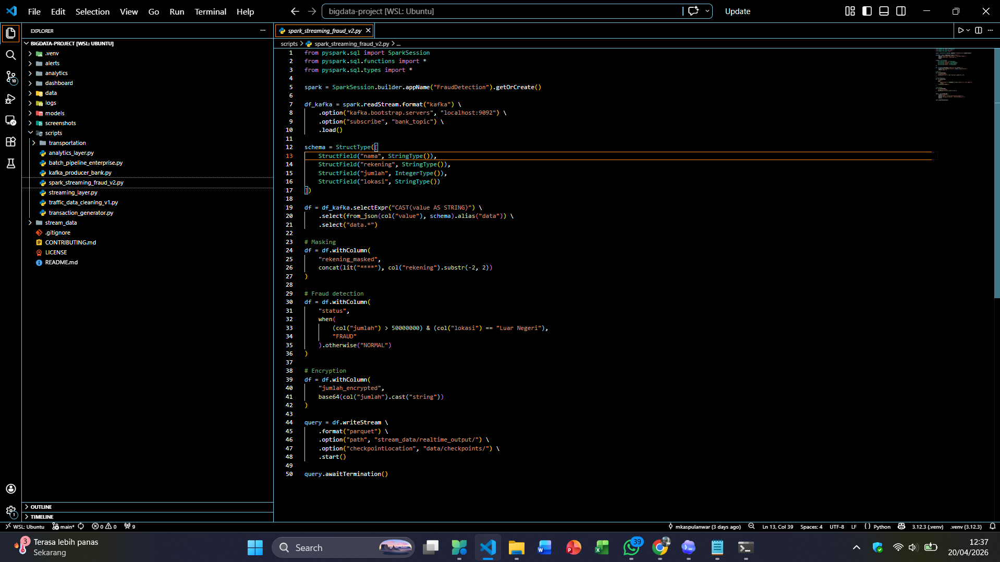
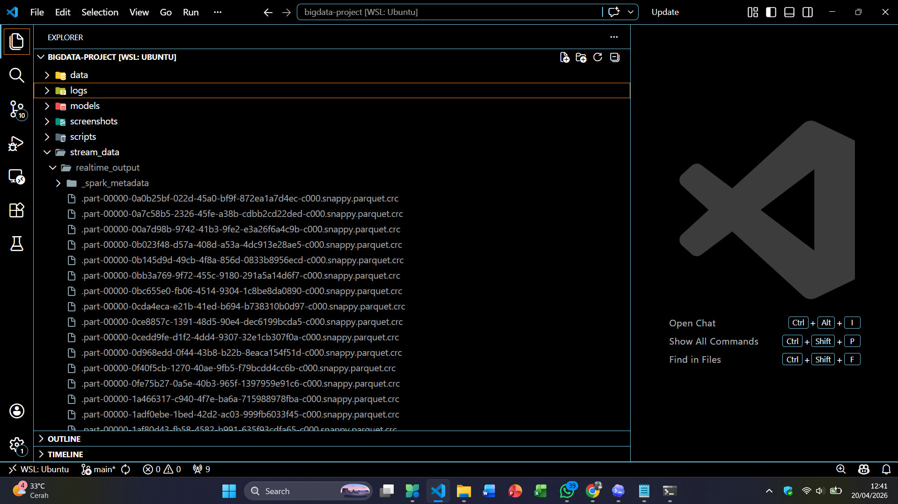
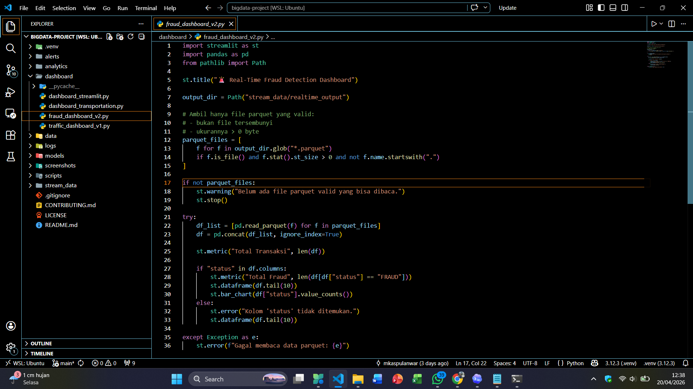

# Praktikum Big Data Week 8: Keamanan dan Privasi Big Data (Real-Time Fraud Detection)


## Tim Praktikum

| Peran | Nama | NIM | Profil GitHub |
| :--- | :--- | :--- | :--- |
| **Pengembang Proyek** | M. Kaspul Anwar | 230104040212 | [](https://github.com/mkaspulanwar) |
| **Dosen Pengampu** | Muhayat, M. IT | - | [](https://github.com/muhayat-lab) |

---

## Ringkasan Praktikum Week 8

Praktikum Week 8 berfokus pada implementasi **keamanan dan privasi data dalam pipeline Big Data real-time** melalui use case **deteksi fraud transaksi bank**.

Praktikum ini adalah kelanjutan langsung dari Week 7:

1. Week 7 membangun kapabilitas **predictive analytics** (machine learning traffic).
2. Week 8 menambahkan lapisan **data protection + fraud monitoring real-time**.
3. Repository kini tidak hanya mampu analitik dan prediksi, tetapi juga mulai menerapkan kontrol keamanan data pada alur streaming.

## Keterkaitan Week 7 -> Week 8

Evolusi proyek yang dibangun:

1. **Week 6**: streaming + analytics operasional.
2. **Week 7**: machine learning untuk prediksi traffic.
3. **Week 8**: keamanan, privasi, dan fraud detection untuk data transaksi real-time.

Dengan demikian, proyek berkembang dari sekadar observasi data menjadi platform yang lebih siap untuk skenario enterprise: **ingest -> process -> analyze -> protect -> monitor**.

## Tujuan Praktikum Week 8

1. Membangun alur streaming transaksi bank berbasis Kafka.
2. Memproses transaksi real-time menggunakan Spark Structured Streaming.
3. Menerapkan teknik privasi data (masking data sensitif).
4. Menerapkan teknik perlindungan nilai transaksi (encoding/encryption demonstratif).
5. Menentukan rule deteksi fraud real-time dan menampilkan hasil monitoring di dashboard.
6. Menjaga kesinambungan arsitektur dari Week 7 ke Week 8.

## Cakupan Fitur Week 8

1. **Kafka Producer** untuk simulasi transaksi bank (`scripts/kafka_producer_bank.py`).
2. **Spark Structured Streaming Consumer** dari topic Kafka `bank_topic` (`scripts/spark_streaming_fraud_v2.py`).
3. **Masking nomor rekening** menjadi format `****xx`.
4. **Encoding/encryption demonstratif nilai transaksi** ke `base64`.
5. **Fraud classification rule-based** dengan label `FRAUD` atau `NORMAL`.
6. **Sink output parquet real-time** ke `stream_data/realtime_output/`.
7. **Dashboard monitoring fraud** berbasis Streamlit (`dashboard/fraud_dashboard_v2.py`).

## Implementasi Keamanan dan Privasi

Kontrol yang sudah diimplementasikan pada pipeline Week 8:

1. **Data masking**
   - Kolom sumber: `rekening`
   - Kolom hasil: `rekening_masked`
   - Tujuan: membatasi ekspos data sensitif di layer monitoring.

2. **Encoding/encryption demonstratif**
   - Kolom sumber: `jumlah`
   - Kolom hasil: `jumlah_encrypted` (base64)
   - Tujuan: menunjukkan konsep proteksi nilai transaksi sebelum konsumsi downstream.

3. **Fraud detection real-time**
   - Rule saat ini: `jumlah > 50.000.000` dan `lokasi == "Luar Negeri"` -> `FRAUD`
   - Selain itu diklasifikasikan sebagai `NORMAL`.

## Arsitektur Sistem (Week 7 -> Week 8)



## Struktur Project (Terbaru)

```bash
bigdata-project/
├── alerts/
│   ├── __init__.py
│   └── transportation_alert.py
├── analytics/
│   ├── __init__.py
│   ├── traffic_ml_model_v1.py                 # Week 7 modeling
│   └── transportation_analytics.py
├── dashboard/
│   ├── dashboard_streamlit.py
│   ├── dashboard_transportation.py
│   ├── traffic_dashboard_v1.py                # Week 7 dashboard
│   └── fraud_dashboard_v2.py                  # Week 8 dashboard fraud
├── data/
│   ├── checkpoints/                           # Spark checkpoint
│   ├── clean/
│   │   └── traffic_smartcity_clean_v1.csv
│   ├── curated/
│   ├── raw/
│   │   ├── ecommerce_raw.csv
│   │   └── traffic_smartcity_v1.csv
│   └── serving/
├── logs/
├── models/
│   └── traffic_model_v1.pkl
├── screenshots/
│   ├── kafka_berjalan.png
│   ├── python_kafka_producer.png
│   ├── spark_streaming_berjalan.png
│   ├── python_spark_streaming.png
│   ├── realtime_output.png
│   ├── python_fraud_dashboard.png
│   ├── dashboard_1.png
│   └── dashboard_2.png
├── scripts/
│   ├── kafka_producer_bank.py                 # Week 8 producer transaksi
│   ├── spark_streaming_fraud_v2.py            # Week 8 Spark streaming + fraud rule
│   ├── traffic_data_cleaning_v1.py            # Week 7 cleaning
│   ├── analytics_layer.py
│   ├── batch_pipeline_enterprise.py
│   ├── streaming_layer.py
│   ├── transaction_generator.py
│   └── transportation/
│       ├── streaming_trip_layer.py
│       └── trip_generator.py
├── stream_data/
│   ├── realtime_output/                       # Output parquet Week 8
│   └── transportation/
├── .gitignore
├── CONTRIBUTING.md
├── LICENSE
└── README.md
```

## Bukti Screenshots Praktikum 8

<table>
<tr>
<td align="center"><b>Kafka Berjalan</b></td>
<td align="center"><b>Eksekusi Kafka Producer</b></td>
</tr>
<tr>
<td></td>
<td></td>
</tr>

<tr>
<td align="center"><b>Spark Streaming Berjalan</b></td>
<td align="center"><b>Eksekusi Spark Streaming Script</b></td>
</tr>
<tr>
<td></td>
<td></td>
</tr>

<tr>
<td align="center"><b>Output Realtime (Parquet)</b></td>
<td align="center"><b>Eksekusi Fraud Dashboard</b></td>
</tr>
<tr>
<td></td>
<td></td>
</tr>

<tr>
<td align="center"><b>Tampilan Dashboard (1)</b></td>
<td align="center"><b>Tampilan Dashboard (2)</b></td>
</tr>
<tr>
<td></td>
<td></td>
</tr>
</table>

## Skema Data Week 8

### 1) Event Input (Kafka Producer)

Field transaksi yang dikirim ke topic `bank_topic`:

| Kolom | Tipe | Deskripsi |
| :--- | :--- | :--- |
| `nama` | string | Nama nasabah/sumber transaksi |
| `rekening` | string | Nomor rekening asli (sensitif) |
| `jumlah` | int | Nominal transaksi |
| `lokasi` | string | Lokasi transaksi (`Jakarta` / `Luar Negeri`) |

### 2) Field Turunan (Spark Streaming)

Field tambahan hasil transformasi keamanan:

| Kolom | Tipe | Deskripsi |
| :--- | :--- | :--- |
| `rekening_masked` | string | Nomor rekening yang sudah dimasking (`****xx`) |
| `status` | string | Label fraud (`FRAUD` / `NORMAL`) |
| `jumlah_encrypted` | string | Nilai `jumlah` yang di-encode base64 |

## Alur End-to-End Praktikum 8

### 1) Jalankan Infrastruktur Kafka

Pastikan Kafka aktif di `localhost:9092`.

Jika topic belum ada, buat topic `bank_topic`:

```bash
kafka-topics --create --topic bank_topic --bootstrap-server localhost:9092 --partitions 1 --replication-factor 1
```

### 2) Jalankan Producer Transaksi Bank

```bash
python scripts/kafka_producer_bank.py
```

Output terminal akan menampilkan transaksi JSON baru setiap ~2 detik.

### 3) Jalankan Spark Structured Streaming

```bash
python scripts/spark_streaming_fraud_v2.py
```

Proses ini akan:

1. Consume data dari Kafka.
2. Melakukan masking data rekening.
3. Melakukan encoding nilai transaksi.
4. Menentukan status fraud.
5. Menulis output parquet ke `stream_data/realtime_output/`.

### 4) Jalankan Dashboard Fraud Real-Time

```bash
streamlit run dashboard/fraud_dashboard_v2.py
```

Dashboard menampilkan:

1. Total transaksi.
2. Total fraud.
3. Tabel data terbaru.
4. Bar chart distribusi status.

## Setup Environment

### 1) Prasyarat

1. Python 3.10+ (disarankan 3.12).
2. Java 8/11+ (untuk Spark).
3. Apache Spark.
4. Apache Kafka.
5. Virtual environment Python.

### 2) Membuat Virtual Environment

Linux/macOS:

```bash
python -m venv .venv
source .venv/bin/activate
```

PowerShell:

```powershell
python -m venv .venv
.venv\Scripts\Activate.ps1
```

### 3) Install Dependency Python

```bash
pip install pyspark kafka-python streamlit pandas pyarrow
```

## Quick Run (Praktikum 8)

Disarankan jalankan di 3 terminal terpisah dari root project:

```bash
# Terminal 1
python scripts/kafka_producer_bank.py

# Terminal 2
python scripts/spark_streaming_fraud_v2.py

# Terminal 3
streamlit run dashboard/fraud_dashboard_v2.py
```

## Validasi Keberhasilan Praktikum 8

Praktikum dianggap berhasil jika:

1. Producer terus mengirim event transaksi ke Kafka (terminal producer aktif mencetak data).
2. Folder `stream_data/realtime_output/` terisi file parquet baru.
3. Dashboard terbuka tanpa error dan menampilkan metrik `Total Transaksi` serta `Total Fraud`.
4. Distribusi status `FRAUD` dan `NORMAL` muncul pada chart.
5. Data yang tampil sudah memuat kolom keamanan (`rekening_masked`, `jumlah_encrypted`).

## Integrasi Dengan Praktikum Sebelumnya

Repository ini sekarang mencakup beberapa lapisan kemampuan Big Data:

1. **Batch + Streaming Data Engineering** (fondasi awal).
2. **Real-Time Analytics dan Dashboarding** (Week 6).
3. **Predictive Analytics (ML Traffic)** (Week 7).
4. **Security & Privacy Real-Time Fraud Monitoring** (Week 8).

Pendekatan ini membuat project lebih holistik untuk skenario implementasi enterprise: performa analitik tetap berjalan, sekaligus mulai menerapkan kontrol perlindungan data sensitif.

## Troubleshooting Week 8

1. Jika muncul `NoBrokersAvailable`, pastikan Kafka aktif di `localhost:9092`.
2. Jika Spark gagal start, cek instalasi Java dan kompatibilitas versi Spark.
3. Jika dashboard menampilkan pesan belum ada file valid, jalankan producer dan Spark dulu sampai output parquet terbentuk.
4. Jika kolom `status` tidak muncul di dashboard, pastikan script Spark yang dijalankan adalah `spark_streaming_fraud_v2.py`.
5. Jika pembacaan parquet error, pastikan dependency `pyarrow` sudah terinstall.

## Keterbatasan Implementasi Saat Ini

1. Mekanisme `jumlah_encrypted` masih berupa base64 (demonstrasi), belum enkripsi kriptografis kuat.
2. Rule fraud masih statis (threshold-based), belum berbasis ML anomaly detection.
3. Belum ada manajemen key, audit trail keamanan, dan access control terpusat.
4. Belum ada skema data retention dan data governance formal.

## Rencana Pengembangan Lanjutan

1. Ganti encoding base64 dengan enkripsi kuat (misal AES + key management).
2. Tambahkan model anomaly detection untuk fraud (unsupervised/supervised).
3. Integrasikan alert otomatis ke kanal notifikasi saat status `FRAUD` terdeteksi.
4. Terapkan audit logging keamanan dan RBAC untuk akses data sensitif.
5. Satukan pipeline lintas domain (traffic + transportation + fraud) dalam orkestrasi terpadu.

## Penutup

Praktikum Week 8 berhasil menambahkan lapisan penting yang sebelumnya belum ada di Week 7, yaitu **keamanan dan privasi data pada alur streaming real-time**. Hasil akhirnya adalah repository yang semakin matang: tidak hanya mampu mengolah dan menganalisis data, tetapi juga mulai menjaga kerahasiaan data sensitif sambil melakukan monitoring fraud secara langsung.
